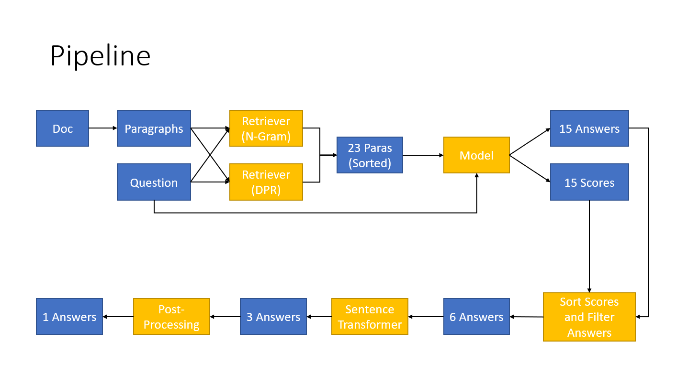

# Extractive Question Answering

## Pipeline



## Installation

```
pip install -r requirements.txt
```

## Modify the config.yaml

 - `command` : 3 modes (evaluate, test, debug)
 - `LIMIT` : top 6 greatest scores of answer span from QnA model (default: 6)
 - `LIMIT_RR` : top 3 greatest scores of related answers from Sentence Similarity model (default: 3)
 - `question` :
    - `path` : path to excel .xlsx file
 - `data` :
    - `name` : name of the data from the excel .xlsx file
    - `path` : path to folder containing the .txt document files
 - `model` :
    - `qa_name` : path to QnA model or name of the model from HuggingFace
    - `sen_sim_name` : path to Sentence Similarity model or name of the model from HuggingFace
    - `retriever` :
        - `query_emb_name` : path to DPR Query model or name of the model from HuggingFace
        - `passage_emb_name` : path to DPR Passage model or name of the model from HuggingFace
    - `device` : the index of the GPU ('cpu' if device has no GPU)
- `report` :
    - `path` : path to save excel report file

## Run

```
python main.py
```